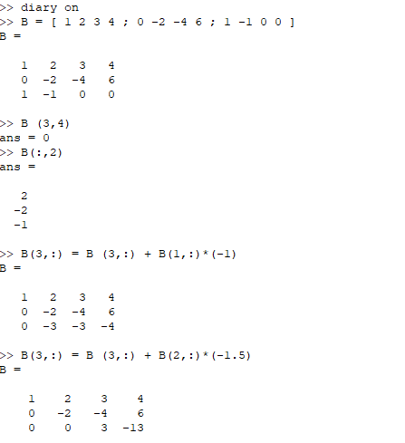
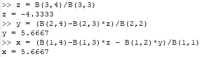
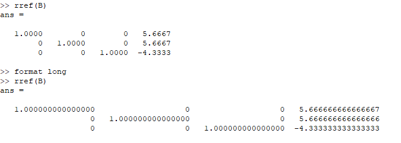
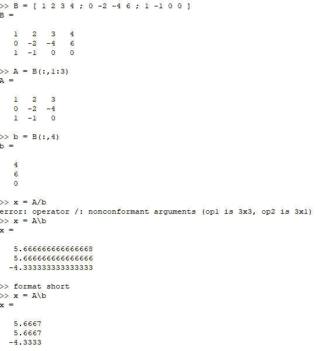
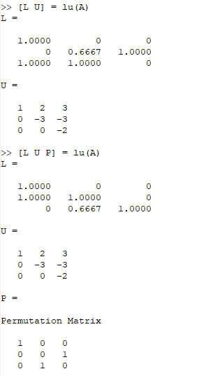

---
# Front matter
lang: ru-RU
title: "Отчет по лабораторной работе 4"
subtitle: " Системы линейных уравнений"
author: "Илья Валерьевич Фирстов"

# Formatting
toc-title: "Содержание"
toc: true # Table of contents
toc_depth: 2
lof: true # List of figures
lot: true # List of tables
fontsize: 12pt
linestretch: 1.5
papersize: a4paper
documentclass: scrreprt
polyglossia-lang: russian
polyglossia-otherlangs: english
mainfont: PT Serif
romanfont: PT Serif
sansfont: PT Sans
monofont: PT Mono
mainfontoptions: Ligatures=TeX
romanfontoptions: Ligatures=TeX
sansfontoptions: Ligatures=TeX,Scale=MatchLowercase
monofontoptions: Scale=MatchLowercase
indent: true
pdf-engine: lualatex
header-includes:
  - \linepenalty=10 # the penalty added to the badness of each line within a paragraph (no associated penalty node) Increasing the value makes tex try to have fewer lines in the paragraph.
  - \interlinepenalty=0 # value of the penalty (node) added after each line of a paragraph.
  - \hyphenpenalty=50 # the penalty for line breaking at an automatically inserted hyphen
  - \exhyphenpenalty=50 # the penalty for line breaking at an explicit hyphen
  - \binoppenalty=700 # the penalty for breaking a line at a binary operator
  - \relpenalty=500 # the penalty for breaking a line at a relation
  - \clubpenalty=150 # extra penalty for breaking after first line of a paragraph
  - \widowpenalty=150 # extra penalty for breaking before last line of a paragraph
  - \displaywidowpenalty=50 # extra penalty for breaking before last line before a display math
  - \brokenpenalty=100 # extra penalty for page breaking after a hyphenated line
  - \predisplaypenalty=10000 # penalty for breaking before a display
  - \postdisplaypenalty=0 # penalty for breaking after a display
  - \floatingpenalty = 20000 # penalty for splitting an insertion (can only be split footnote in standard LaTeX)
  - \raggedbottom # or \flushbottom
  - \usepackage{float} # keep figures where there are in the text
  - \floatplacement{figure}{H} # keep figures where there are in the text
---

# Цель работы

Ознакомиться с функциями, предназначенными для решения СЛАУ в языке Octave

# Задание

Опробовать решение систем линейных уравнений при помощи команд языка Octave, ознакомиться с разными методами, представленными в этом языке.

# Выполнение лабораторной работы

Ввел в Octave матрицу, приведенную в примере. Посмотрел отображение разных элементов, строк и столбцов. Привел исходную матрицу к диагональному виду (рис. -@fig:001)

{ #fig:001 width=70% }

Привычным методом нашел все три неизвестные переменные (по нижнему уравнению найти последнюю неизвестную, затем "подниматься", вычисляя остальные неизвестные) (рис. -@fig:002)

{ #fig:002 width=70% }

Нашел решение при помощи команды rref, просмотрел разное форматирование при помощи команды format (рис. -@fig:003)

{ #fig:003 width=70% }

Ввел расширенную матрицу, затем выделил из нее матрицу и вектор-столбец, а затем разделил матрицу на вектор. (рис. -@fig:004)

{ #fig:004 width=70% }

При помощи команды lu языка Octave выполнил LU и LUP-преобразование матрицы (рис. -@fig:005)

{ #fig:005 width=70% }

# Выводы

Я ознакомился с решением уравнений при помощи языка Octave

# Использованные материалы

Методичка к лабораторной работе
