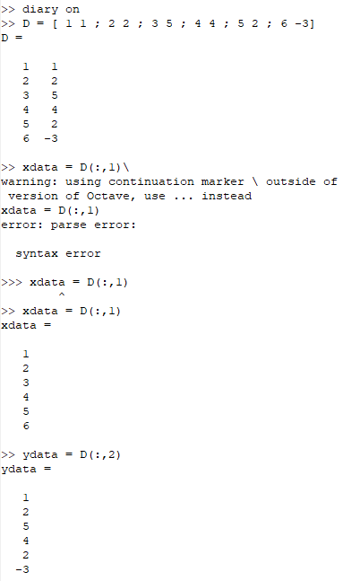
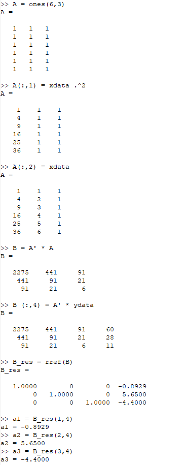
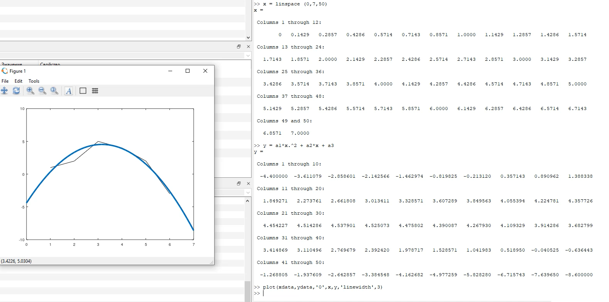
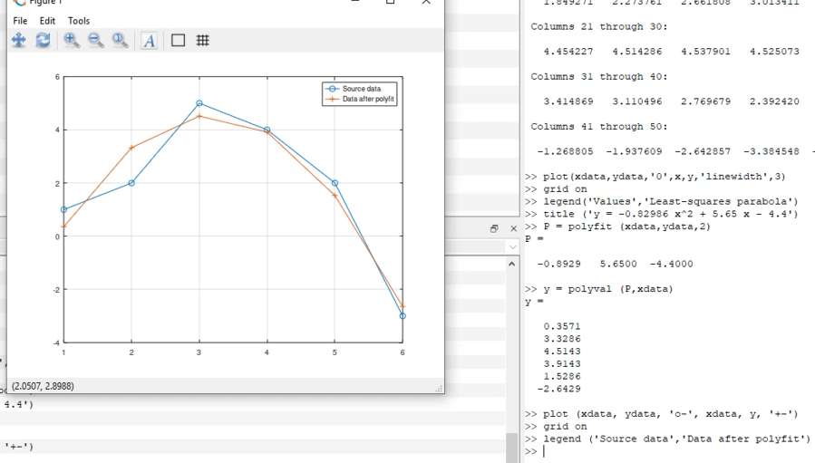
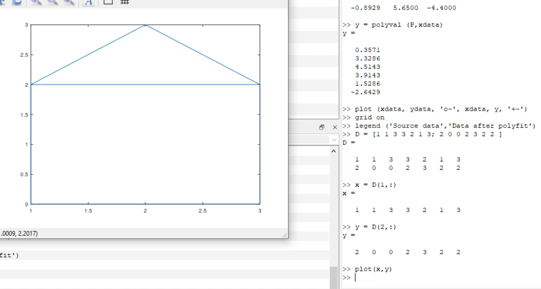
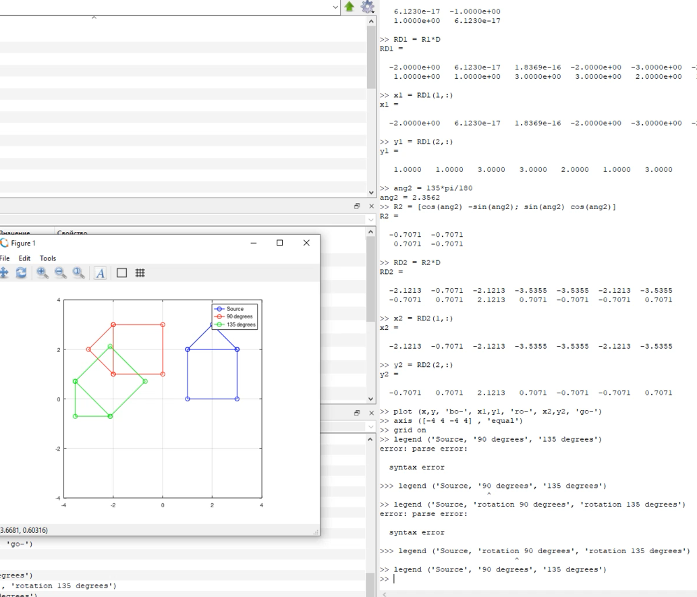
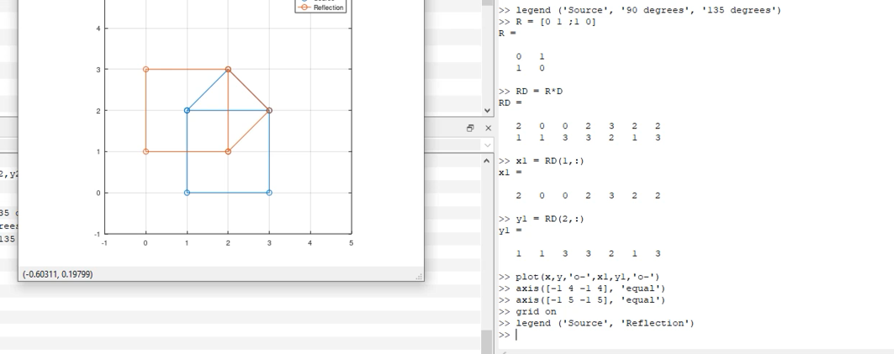
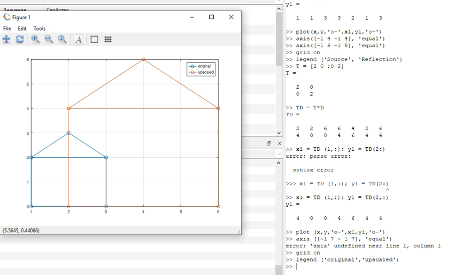

---
# Front matter
lang: ru-RU
title: "Отчет по лабораторной работе 5"
subtitle: "Матричные преобразования в языке Octave"
author: "Илья Валерьевич Фирстов"

# Formatting
toc-title: "Содержание"
toc: true # Table of contents
toc_depth: 2
lof: true # List of figures
lot: true # List of tables
fontsize: 12pt
linestretch: 1.5
papersize: a4paper
documentclass: scrreprt
polyglossia-lang: russian
polyglossia-otherlangs: english
mainfont: PT Serif
romanfont: PT Serif
sansfont: PT Sans
monofont: PT Mono
mainfontoptions: Ligatures=TeX
romanfontoptions: Ligatures=TeX
sansfontoptions: Ligatures=TeX,Scale=MatchLowercase
monofontoptions: Scale=MatchLowercase
indent: true
pdf-engine: lualatex
header-includes:
  - \linepenalty=10 # the penalty added to the badness of each line within a paragraph (no associated penalty node) Increasing the value makes tex try to have fewer lines in the paragraph.
  - \interlinepenalty=0 # value of the penalty (node) added after each line of a paragraph.
  - \hyphenpenalty=50 # the penalty for line breaking at an automatically inserted hyphen
  - \exhyphenpenalty=50 # the penalty for line breaking at an explicit hyphen
  - \binoppenalty=700 # the penalty for breaking a line at a binary operator
  - \relpenalty=500 # the penalty for breaking a line at a relation
  - \clubpenalty=150 # extra penalty for breaking after first line of a paragraph
  - \widowpenalty=150 # extra penalty for breaking before last line of a paragraph
  - \displaywidowpenalty=50 # extra penalty for breaking before last line before a display math
  - \brokenpenalty=100 # extra penalty for page breaking after a hyphenated line
  - \predisplaypenalty=10000 # penalty for breaking before a display
  - \postdisplaypenalty=0 # penalty for breaking after a display
  - \floatingpenalty = 20000 # penalty for splitting an insertion (can only be split footnote in standard LaTeX)
  - \raggedbottom # or \flushbottom
  - \usepackage{float} # keep figures where there are in the text
  - \floatplacement{figure}{H} # keep figures where there are in the text
---

# Цель работы

Освоить матричные преобразования в языке Octave. Попробовать подгонку полинома.

# Задание

Ввести матрицы, проделать с ними операции преобразования, например вращение или отражение. Решить уравнение по методу Гаусса и подогнать решение.

# Выполнение лабораторной работы

### Решение методом наименьших квадратов и подгонка

Ввел матрицу данных D (рис. -@fig:001)

{ #fig:001 width=70% }

Составил из данных матрицу для решения уравнения вида y = ax^2+bx+c и решил уравнение(рис. -@fig:002)

{ #fig:002 width=70% }

Построил параболу решения уравнения (рис. -@fig:003)

{ #fig:003 width=70% }

Подогнал решение (рис. -@fig:004)

{ #fig:004 width=70% }

### Операции над матрицами

Ввел исходную матрицу (рис. -@fig:005)

{ #fig:005 width=70% }

Повернул матрицу на 90 и 135 градусов, построил графики (рис. -@fig:006)

{ #fig:006 width=70% }

Отразил матрицу относительно прямой х=у (рис. -@fig:007)

{ #fig:007 width=70% }

Увеличил исходную матрицу (рис. -@fig:008)

{ #fig:008 width=70% }

# Выводы

Я ознакомился решением уравнений методом минимальных квадратов в языке Octave, а также с операциями над матрицами

# Использованные материалы

Методичка к лабораторной работе
