---
# Front matter
lang: ru-RU
title: "Отчет по лабораторной работе 7"
subtitle: "Построение различных графиков в языке Octave"
author: "Илья Валерьевич Фирстов"

# Formatting
toc-title: "Содержание"
toc: true # Table of contents
toc_depth: 2
lof: true # List of figures
lot: true # List of tables
fontsize: 12pt
linestretch: 1.5
papersize: a4paper
documentclass: scrreprt
polyglossia-lang: russian
polyglossia-otherlangs: english
mainfont: PT Serif
romanfont: PT Serif
sansfont: PT Sans
monofont: PT Mono
mainfontoptions: Ligatures=TeX
romanfontoptions: Ligatures=TeX
sansfontoptions: Ligatures=TeX,Scale=MatchLowercase
monofontoptions: Scale=MatchLowercase
indent: true
pdf-engine: lualatex
header-includes:
  - \linepenalty=10 # the penalty added to the badness of each line within a paragraph (no associated penalty node) Increasing the value makes tex try to have fewer lines in the paragraph.
  - \interlinepenalty=0 # value of the penalty (node) added after each line of a paragraph.
  - \hyphenpenalty=50 # the penalty for line breaking at an automatically inserted hyphen
  - \exhyphenpenalty=50 # the penalty for line breaking at an explicit hyphen
  - \binoppenalty=700 # the penalty for breaking a line at a binary operator
  - \relpenalty=500 # the penalty for breaking a line at a relation
  - \clubpenalty=150 # extra penalty for breaking after first line of a paragraph
  - \widowpenalty=150 # extra penalty for breaking before last line of a paragraph
  - \displaywidowpenalty=50 # extra penalty for breaking before last line before a display math
  - \brokenpenalty=100 # extra penalty for page breaking after a hyphenated line
  - \predisplaypenalty=10000 # penalty for breaking before a display
  - \postdisplaypenalty=0 # penalty for breaking after a display
  - \floatingpenalty = 20000 # penalty for splitting an insertion (can only be split footnote in standard LaTeX)
  - \raggedbottom # or \flushbottom
  - \usepackage{float} # keep figures where there are in the text
  - \floatplacement{figure}{H} # keep figures where there are in the text
---

# Цель работы

Ознакомиться с построением графиков различных уравнений в языке Octave.

# Задание

Построить графики заданных уравнений при помощи Octave. 

# Выполнение лабораторной работы

### Параметрические графики

Ввел параметрическое уравнение циклоиды (рис. -@fig:001)

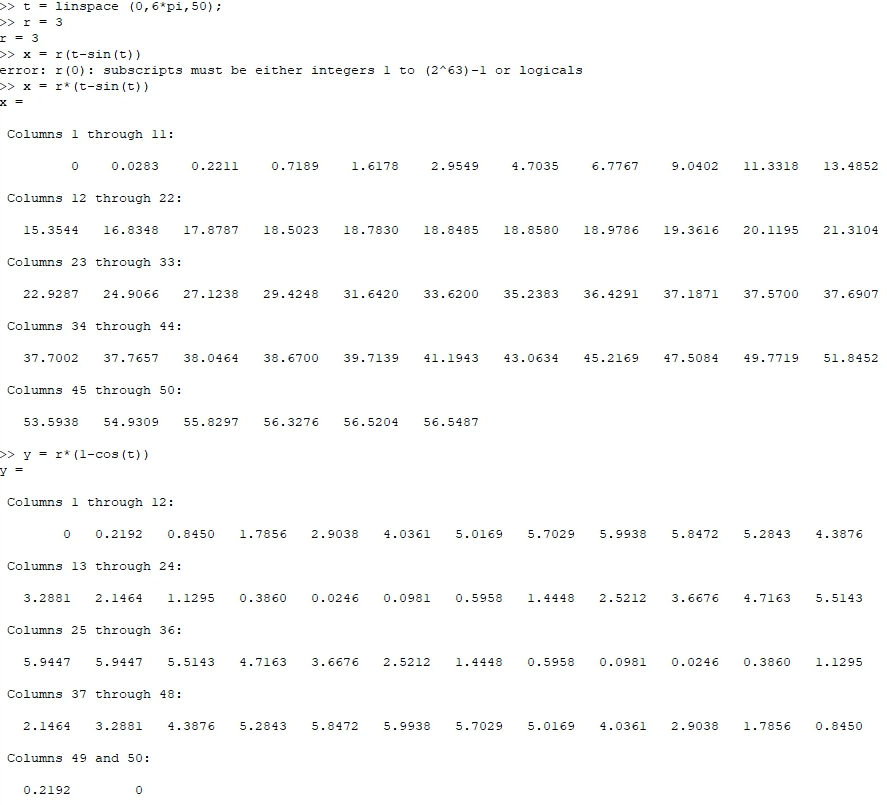{ #fig:001 width=70% }

На основе этого уравнения построил график (рис. -@fig:002)

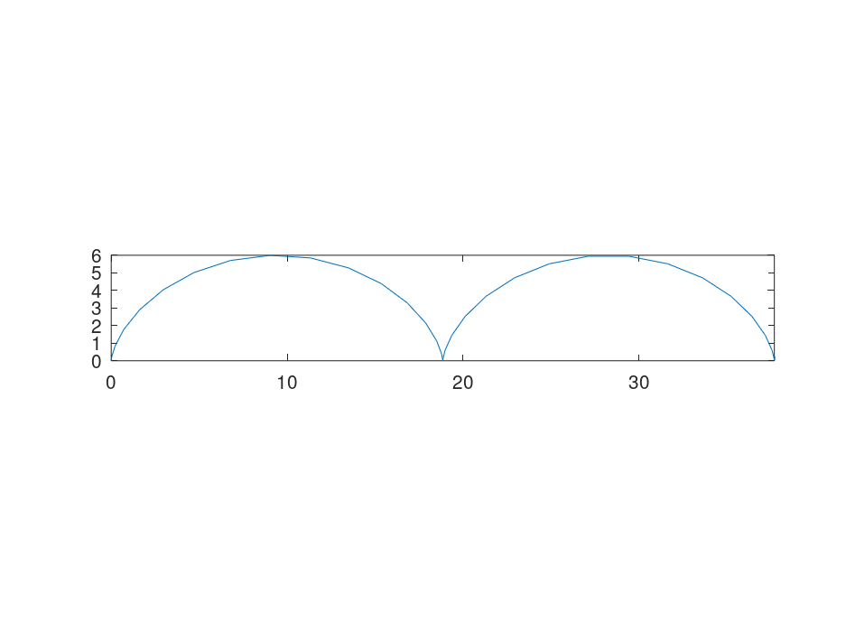{ #fig:002 width=70% }

### Полярные координаты

Ввел уравнение улитки Паскаля в полярных координатах (рис. -@fig:003)

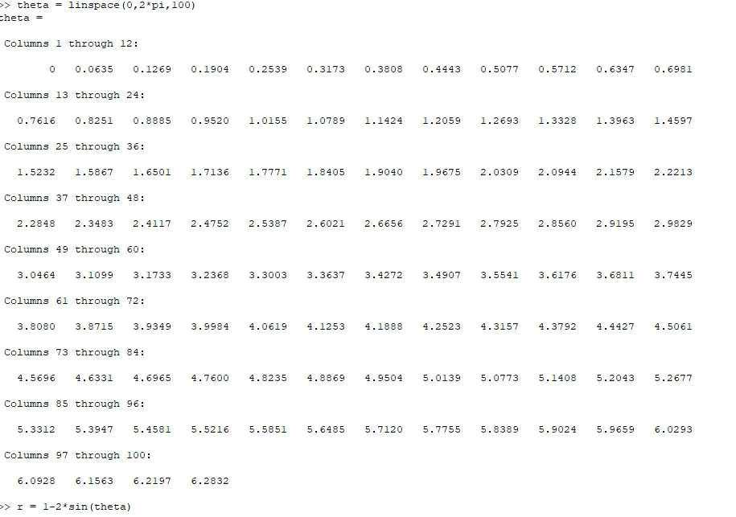{ #fig:003 width=70% }

На основе этого уравнения выполнил преобразование в декартову систему координат(рис. -@fig:004)

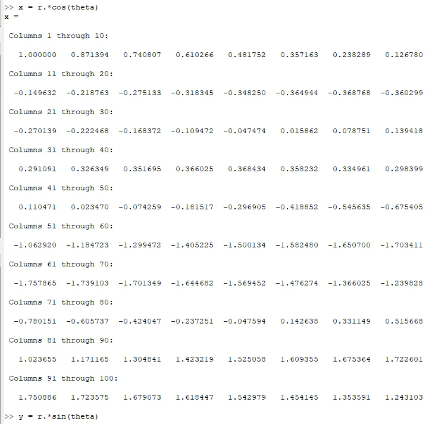{ #fig:004 width=70% }

После этого построил график в декартовых координатах (рис. -@fig:005)

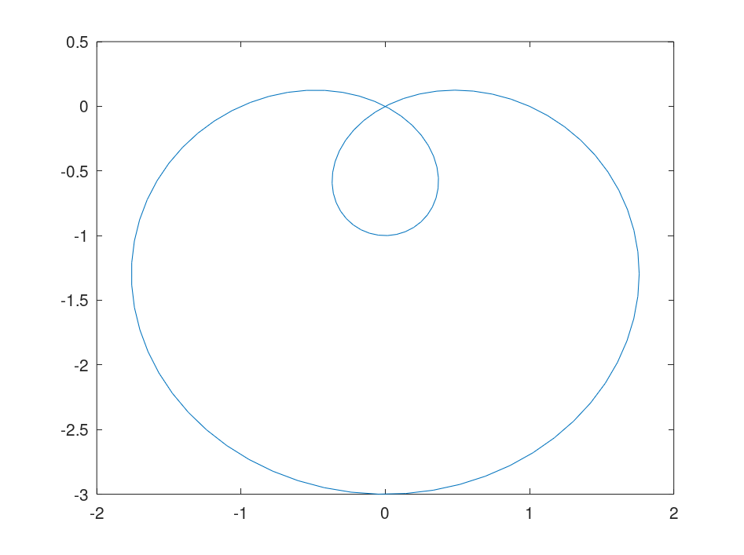{ #fig:005 width=70% }

Затем при помощи команды polar построил график без преобразования в декартовы координаты(рис. -@fig:006)

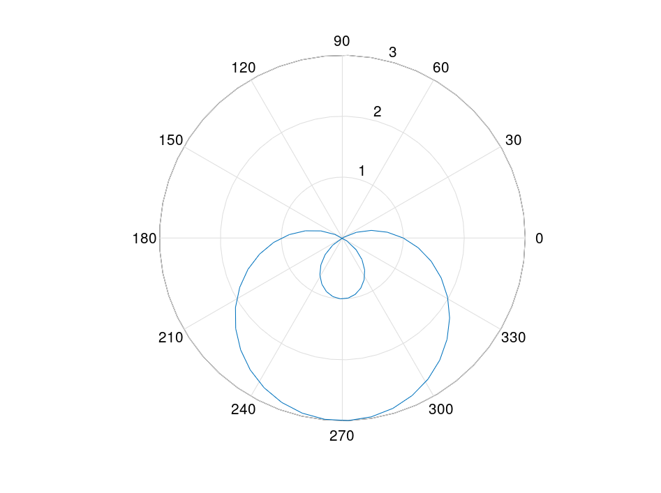{ #fig:006 width=70% }

### Графики неявных функций

Ввел предложенную в методичку функцию, неявно определенную уравнением вида f(x,y) = 0 (рис. -@fig:007)

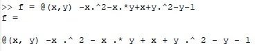{ #fig:007 width=70% }

Построил ее графику при помощи функции ezplot (рис. -@fig:008)

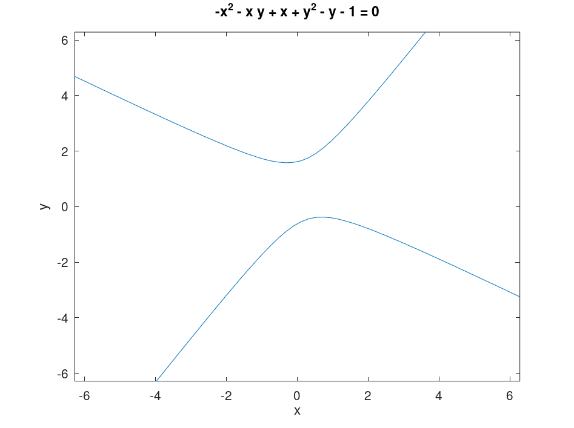{ #fig:008 width=70% }

Ввел приведенное в методичке уравнение окружности (рис. -@fig:009)

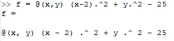{ #fig:009 width=70% }

Построил график функцией ezplot (рис. -@fig:010)

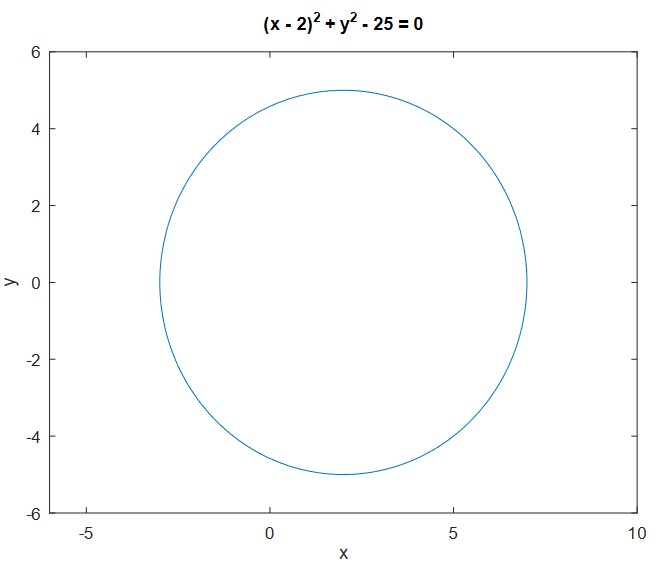{ #fig:010 width=70% }

Ввел уравнение касательной к этой окружности (рис. -@fig:011)

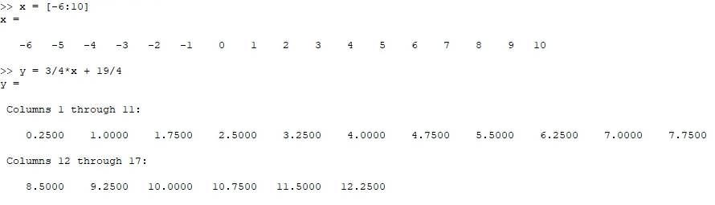{ #fig:011 width=70% }

Построил график этой касательной (рис. -@fig:012)

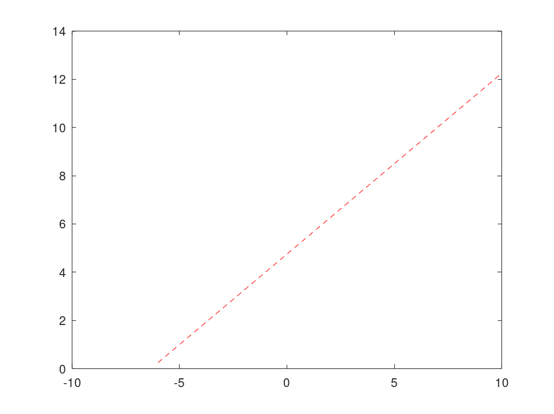{ #fig:012 width=70% }

### Комплексные числа

Ознакомился с операциями с комплексными числами в Octave (рис. -@fig:013)

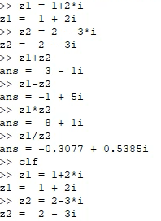{ #fig:013 width=70% }

Построил график комплексных чисел и их линейных комбинаций (рис. -@fig:014)

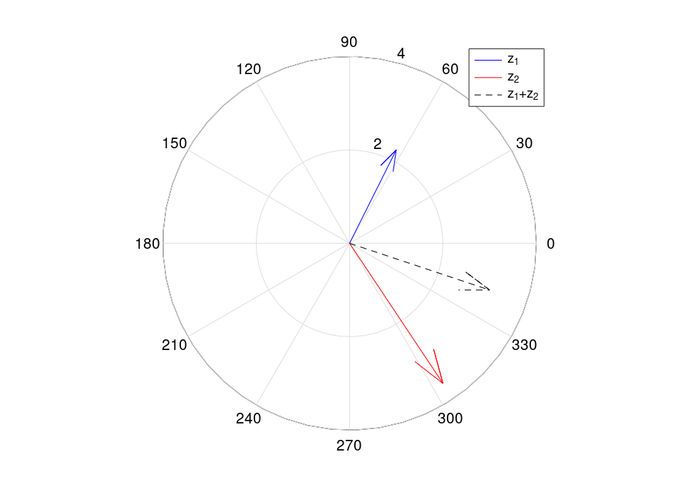{ #fig:014 width=70% }

Ознакомился с поведением Octave при вычислении различных корней (рис. -@fig:015)

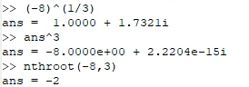{ #fig:015 width=70% }

### Специальные функции

Чтобы построить графики гамма-функции и функции факториала, определил n и x (рис. -@fig:016)

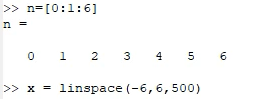{ #fig:016 width=70% }

Построил в одном пространстве факториал и гамма-функцию (рис. -@fig:017)

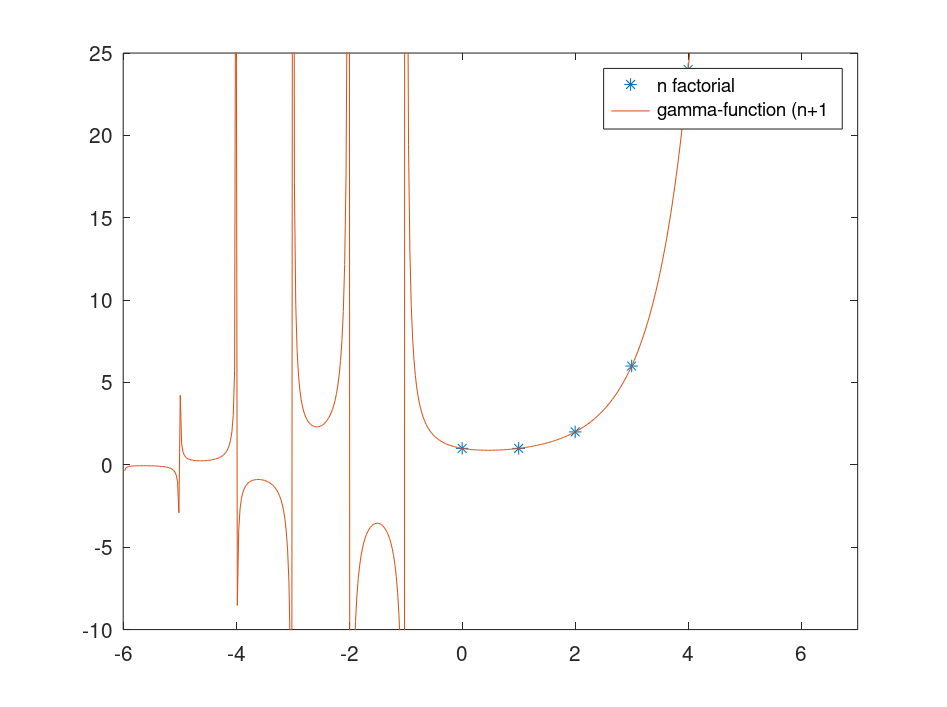{ #fig:017 width=70% }

Чтобы избавиться от артефактов построения в виде вертикальных асимптот, определил несколько отрезков и построил гамма-функцию на этих отрезках (рис. -@fig:018)

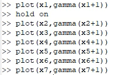{ #fig:018 width=70% }

Итоговый вид графиков получился следующий. (рис. -@fig:019)

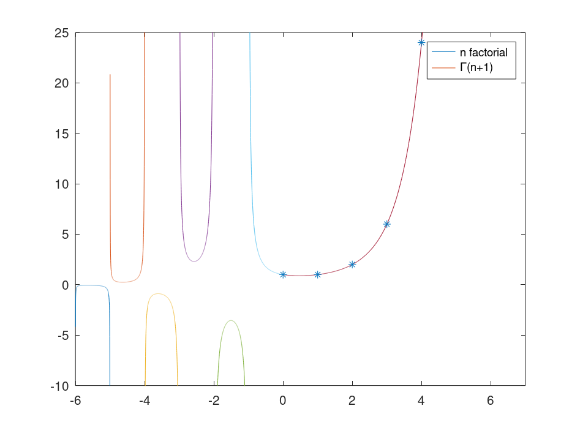{ #fig:019 width=70% }

# Выводы

Я ознакомился с построением графиков различных матемтических функций в языке Octave.

# Использованные материалы

Методичка к лабораторной работе
